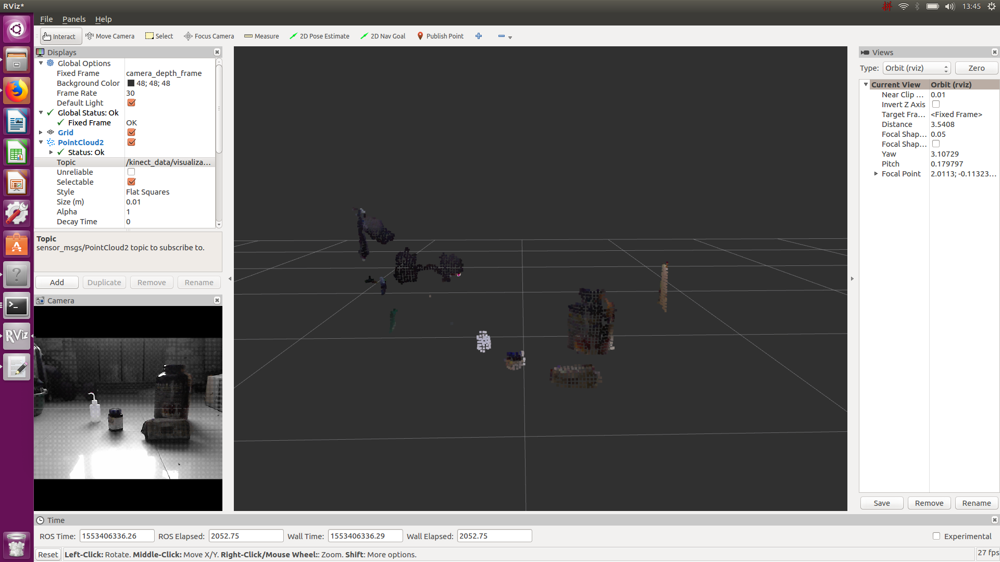

## PCL Object Detection Report

### Tested Device: 

Kinect 1.0, Ubuntu 16.04, ROS kinetic, PCL library

### Install:

For the use of kinect

> sudo apt-get install ros-<rosdistro>-openni-camera
>
> sudo apt-get install ros-<rosdistro>-openni-launch

### Launch & Use:

> roslaunch openni_launch openni.launch depth_registration:=true

If visualization needed

> rviz

 

Run object detection and acquire obstacles location

> rosrun kinect_data kinect_pcl.cpp
>
> rostopic echo /kinect_data/obstacles_location

 

msg "LocationArray" definition: 

> kinect_data::Location   x(x-dimension, smallest), y(DEPTH, smallest), width(x span), height(y span)
>
> int length(object numbers) 
>

 

Visualization. 

change source file "kinect_pcl.cpp" line 34 ---> visulization=true

then recompile it and run.

load this topic in rviz `/kinect_data/obstacles_location`

WARN visualization is TIME CONSUMING 

### Basic Algorithm:

**1 Perform a voxel grid down-sampling**

It can reduce the point clouds number and therefore largely decrease the time needed to compute the points without losing too much accuracy.

**2 Perform a pass through filter **

Objects that are far away from the camera in x-dimension and z-dimension can be neglected.

**3 Perform a plane detection **

Usually, the vehicle drives on a floor which will be detected as “a large plane object”. In order to remove the wrongly detected floor, a RANSAC algorithm is applied to select the largest horizontal plane.

**4 Perform Euclidean & color cluster segmentation **

To separate individual objects, create the KdTree object for the search method of the extraction.

**5 Estimate the object position and size**

With individual points of each objects detected from the last step, calculate the average points position after reducing noise. For future work, SVM or neural network could be implemented to deduce the shape or even the objects itself.